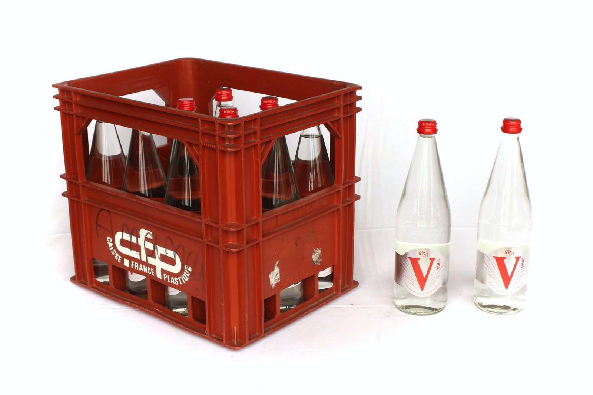
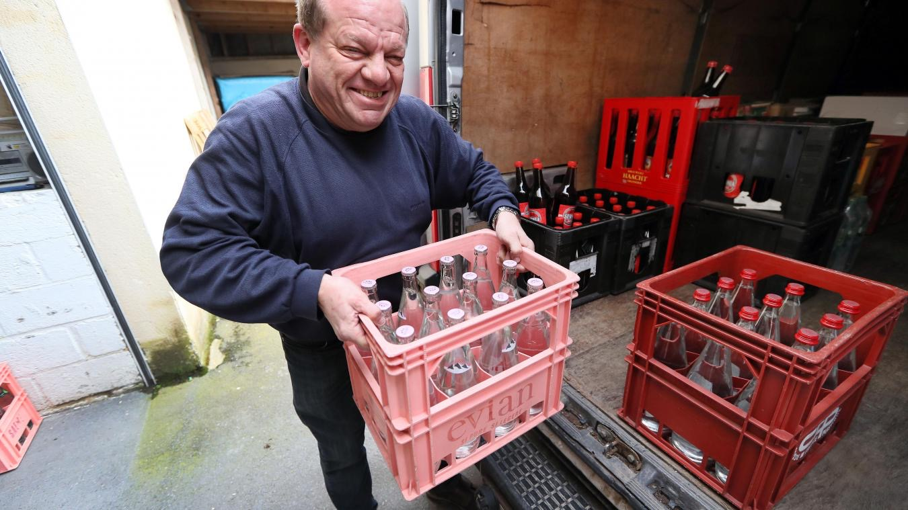
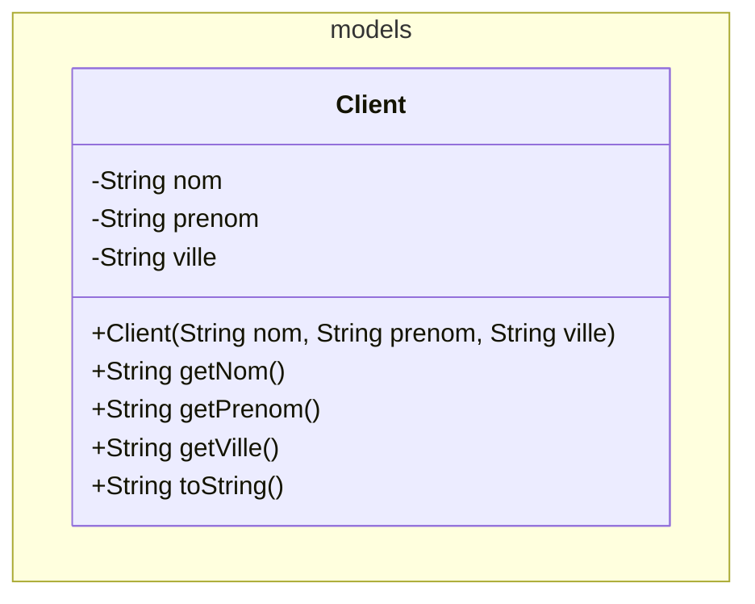
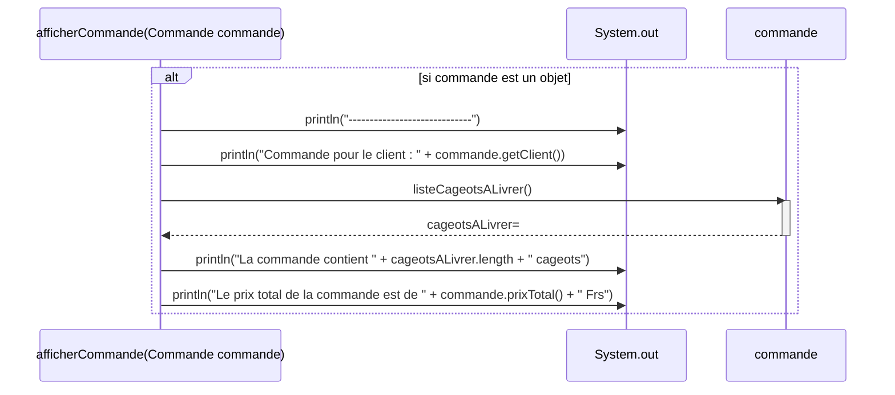

# E1-D400-HalloooBoissons

## Contexte général

L'entreprise `HalloooBoissons` livre régulièrement des bouteilles à ses clients.

Les bouteilles sont transportées et livrées dans des cageots en plastique pouvant accueillir **au maximum 12 bouteilles**.



Ces cageots en plastique  :

- facilitent grandement le stockage des bouteilles dans le camion de livraison.
- permettent de facilement identifier le client a livrer grâce à une étiquette directement sur le cageot.
- facilitent grandement les livraisons et surtout leur portage.

## ATTENTION

Commencez par lire cette consigne `avec grande attention` et prenez garde :

- Les descriptions fonctionnelles sont précises et le choix des mots n'est pas anodin.
- Faites les points mentionnés avec précision et dans l'ordre indiqué.
- Revérifiez bien ensuite avoir fait ce qui est demandé.

## CONSIGNE

### Bouteilles

Dans le package `models` créez une classe nommée `Bouteille`. Une `Bouteille` aura les caractéristiques suivantes : `nom` (genre "Coca", "Sinalco", "Henniez rouge"), `prix` (genre 2.75), `contenance` (pour son volume en litres), `remplissage` (en % donc à une valeur de 100.0 lorsque celle-ci est livrée car pleine) et `enVerre` (pour savoir si celle-ci est en verre ou en plastique).

Toutes ces informations doivent être fournies lors de sa création sauf remplissage dont on connaît d'avance l'état initial.

On doit pouvoir demander toutes ces informations à une bouteille. Aucune de ces informations ne devra pouvoir être modifiée après coup sauf pour le remplissage (car une bouteille de 1.5L de coca en verre reste une bouteille de 1.5L de coca en verre même si on a bu la moitié de son contenu).

Si on affiche une bouteille, celle-ci doit se montrer sous cette forme `"Bouteille 'Henniez rouge' de 1.5L en verre à 2.60 Frs - pleine"` ou encore `"Bouteille 'Sinalco' de 0.5L en verre à 2.10 Frs - vide"` ou encore `"Bouteille 'Pepsi' de 1.0L en plastique à 3.20 Frs - entamée"`. Les montants en francs doivent y être affichés sur deux positions (c-à-d 2.60 Frs et non pas 2.6 Frs).

### Cageots

Toujours dans le package `models`, créez une classe nommée `Cageot` pouvant accueillir un certain nombre de bouteilles et ayant un identifiant textuel unique du genre `"X83H4"`.

Pour créer un nouveau cageot, la seule information à fournir sera son identifiant unique. Concernant le nombre de bouteilles que le cageot pourra contenir, faites en sorte que ce nombre de bouteilles soit fixé à `12`. De même, faites en sorte qu'aussitôt créé un cageot soit vide (= ne contienne pas de bouteilles).

Une fois un cageot créé on ne pourra plus modifier son identifiant mais par contre on pourra toujours le consulter.

On doit pouvoir lui donner l'ordre de ranger une bouteille qui sera stockée uniquement s'il reste encore de la place pour celle-ci.

De même, on doit pouvoir lui prendre une bouteille si celle-ci s'y trouve bien.

On doit pouvoir demander à un cageot le nombre de bouteilles stockées ainsi que le nombre de places encore disponibles.

On doit aussi pouvoir lui demander la liste des bouteilles actuellement stockées.

Et, pour terminer, on doit pouvoir lui demander son prix total, c-à-d la somme du prix de chacune des bouteilles qui y sont stockées.

L'affichage d'un cageot doit montrer ceci `"Cageot 'X83H4' avec X/Y bouteilles"` (avec X étant le nombre de bouteilles stockées et Y le nombre de places encore disponibles). Tant X que Y doivent y être affiché sur deux positions (par exemple `"Cageot 'X83H4' avec 02/12 bouteilles"`).

### Clients

Dans le bon package, vous aller créer une classe permettant de modéliser un client. Les informations utiles pour correctement définir cette classe sont données ci-dessous en UML :



À noter que l'affichage d'un client devra montrer ceci `"Client FRIEDLI Paul - Bulle"` (son nom de famille devra être mis en majuscules).

### Commandes

Toujours dans le package `models`, créez une classe permettant de modéliser une commande. Une commande concerne un seul client qui doit être fourni lors de sa création et ne pourra plus être modifié ensuite, mais on doit pouvoir le demander.

Une commande doit savoir tenter de rajouter un cageot respectivement supprimer un cageot d'elle-même. Comme il n'est pas possible de livrer des commandes de plus de 8 cageots, faites en sorte qu'on ne puisse pas dépasser ces limites lors du rajout ou suppression d'un cageot.

Une commande doit pouvoir être annulée, c-à-d que tous ses cageots seront supprimés.

Au besoin, on doit pouvoir demander à une commande la liste exacte des cageots qu'il faudra livrer.

De même, on doit pouvoir demander à une commande son prix total.

### Application

#### Méthode - `void afficherCommande(Commande commande)`

Le code de cette méthode est directement fourni ci-dessous via un diagramme de séquence UML :



#### Méthode - `void main(String[] args)`

Dans le `main()` de la classe `Application` déjà fournie, effectuez les opérations suivantes :

- Dans un tableau de 10 commandes, placez les deux commandes prévues (voir le détail ci-dessus)
- Ensuite, pour chaque commande présente dans votre tableau, appelez tout simplement la méthode `afficherCommande()` afin de l'afficher.

| Commande | Client | Cageot 1 | Cageot 2 | Cageot 3 |
| :---: | :--- | :--- | :--- | :--- |
| 1 | Jean DUCOBU de Bulle | Identifiant = <b>`"X83H4"`</b><br><br>6x 'Henniez rouge' en verre de 1L à 2.60 Frs la bouteille<br><br>6x 'Henniez verte' en verre de 1L à 2.60 Frs la bouteille | Identifiant = <b>`"X83H5"`</b><br><br>2x 'Coca-Cola' en plastique de 1.5L à 3.85 Frs la bouteille<br><br><br><br> | Identifiant = <b>`"X83H6"`</b><br><br>1x 'Pepsi' en plastique de 1.5L à 3.55 Frs la bouteille<br><br>1x 'Sinalco' en plastique de 1.5L à 4.25 Frs la bouteille |
| 2 | Mac HARONI de Fribourg | Identifiant = <b>`"X83H7"`</b><br><br>1x 'Henniez rouge' en verre de 1L à 2.60 Frs la bouteille<br><br>2x 'Coca-Cola' en plastique de 1.5L à 3.85 Frs la bouteille |  |  |
| | | | | |

## Résultat sur la console

Si vous avez correctement réalisé cette application vous devriez obtenir un affichage ressemblant à ceci :

```text
-------------------------------------------------------------
Commande pour le client : Client DUCOBU Jean - Bulle
La commande contient 3 cageots
Le prix total de la commande est de 46.7 Frs
-------------------------------------------------------------
Commande pour le client : Client HARONI Mac - Fribourg
La commande contient 1 cageots
Le prix total de la commande est de 10.3 Frs
```

## RESTITUTION

1. Faites signe au prof lorsque vous aurez terminé et que vous êtes prêt à rendre. Il vous autorisera à remettre le réseau.
2. Rendez votre travail par `push` GitHub.
3. Quitter rapidement la salle en silence.
